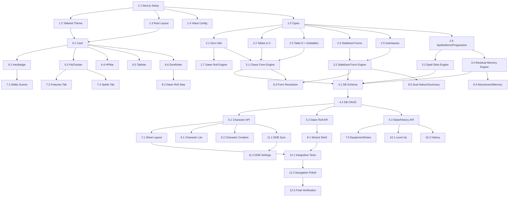

# Fatebound Manager Implementation Plan

> **For Claude:** REQUIRED SUB-SKILL: Use superpowers:executing-plans to implement this plan task-by-task.

**Goal:** Build a full character management web app for The Fatebound homebrew D&D 5e class, with Dawn Roll automation, resource tracking, and D&D Beyond MCP sync.

**Architecture:** Next.js 14 App Router with pure game engine (`engine/`), typed static data (`data/`), SQLite persistence via API routes, and a D&D Beyond-inspired dark theme UI. All game logic is testable independently of UI.

**Tech Stack:** Next.js 14, React 18, TailwindCSS, better-sqlite3, Vitest, Cinzel/Roboto fonts

**Source Material:** The Fatebound class docs live in the Obsidian vault at `~/Library/Mobile Documents/iCloud~md~obsidian/Documents/AlexObsidian/DnD/Homebrew/Classes/The Fatebound/`. Read these files for exact table data, feature descriptions, and subclass details. Do NOT guess — transcribe from the source docs.

---

## Phase 1: Project Scaffolding (Tasks 1.1–1.5)

### Task 1.1: Initialize Next.js Project

**Files:**
- Create: `~/fatebound-manager/package.json` (via npx)
- Create: `~/fatebound-manager/tsconfig.json` (via npx)

**Step 1: Create Next.js app**

```bash
cd ~/fatebound-manager
npx create-next-app@latest . --typescript --tailwind --eslint --app --src-dir --no-import-alias --use-npm
```

Accept defaults. This scaffolds into the existing directory.

**Step 2: Install dependencies**

```bash
cd ~/fatebound-manager
npm install better-sqlite3 uuid
npm install -D @types/better-sqlite3 @types/uuid vitest @vitejs/plugin-react
```

**Step 3: Commit**

```bash
git add -A
git commit -m "chore: initialize Next.js project with dependencies"
```

---

### Task 1.2: Configure Tailwind Theme

**Files:**
- Modify: `~/fatebound-manager/tailwind.config.ts`

**Step 1: Replace tailwind.config.ts with custom DDB-inspired theme**

```typescript
import type { Config } from "tailwindcss";

const config: Config = {
  content: [
    "./src/pages/**/*.{js,ts,jsx,tsx,mdx}",
    "./src/components/**/*.{js,ts,jsx,tsx,mdx}",
    "./src/app/**/*.{js,ts,jsx,tsx,mdx}",
  ],
  theme: {
    extend: {
      colors: {
        "bg-deep": "#0B0B0D",
        "bg-surface": "#1A1B1E",
        "bg-elevated": "#242528",
        "bg-hover": "#2C2D31",
        accent: {
          DEFAULT: "#C53131",
          hover: "#E03E3E",
          muted: "#8B2020",
        },
        fate: {
          DEFAULT: "#7C3AED",
          glow: "#A78BFA",
        },
        "text-primary": "#E8E6E3",
        "text-secondary": "#9B9B9B",
        "text-highlight": "#FFFFFF",
        "border-subtle": "#333538",
        "border-accent": "#C53131",
        hp: {
          green: "#22C55E",
          yellow: "#EAB308",
          red: "#EF4444",
        },
      },
      fontFamily: {
        heading: ["Cinzel", "serif"],
        body: ["Roboto", "sans-serif"],
        mono: ["Roboto Mono", "monospace"],
      },
    },
  },
  plugins: [],
};
export default config;
```

**Step 2: Commit**

```bash
git add tailwind.config.ts
git commit -m "feat: configure D&D Beyond-inspired dark theme palette"
```

---

### Task 1.3: Configure Root Layout with Fonts & Dark Theme

**Files:**
- Modify: `~/fatebound-manager/src/app/layout.tsx`
- Modify: `~/fatebound-manager/src/app/globals.css`

**Step 1: Update globals.css**

Replace the entire file. Keep Tailwind directives, add base dark theme styles:

```css
@tailwind base;
@tailwind components;
@tailwind utilities;

@import url('https://fonts.googleapis.com/css2?family=Cinzel:wght@400;600;700&family=Roboto:wght@300;400;500;700&family=Roboto+Mono:wght@400;500&display=swap');

@layer base {
  body {
    @apply bg-bg-deep text-text-primary font-body;
  }

  h1, h2, h3, h4 {
    @apply font-heading;
  }
}
```

**Step 2: Update layout.tsx**

```tsx
import type { Metadata } from "next";
import "./globals.css";

export const metadata: Metadata = {
  title: "Fatebound Manager",
  description: "Character manager for The Fatebound homebrew D&D 5e class",
};

export default function RootLayout({
  children,
}: {
  children: React.ReactNode;
}) {
  return (
    <html lang="en" className="dark">
      <body className="min-h-screen bg-bg-deep text-text-primary font-body antialiased">
        {children}
      </body>
    </html>
  );
}
```

**Step 3: Commit**

```bash
git add src/app/layout.tsx src/app/globals.css
git commit -m "feat: root layout with dark theme, Cinzel/Roboto fonts"
```

---

### Task 1.4: Configure Vitest

**Files:**
- Create: `~/fatebound-manager/vitest.config.ts`

**Step 1: Create vitest config**

```typescript
import { defineConfig } from "vitest/config";
import path from "path";

export default defineConfig({
  test: {
    globals: true,
    environment: "node",
  },
  resolve: {
    alias: {
      "@": path.resolve(__dirname, "./src"),
    },
  },
});
```

**Step 2: Add test script to package.json**

Add to `"scripts"`:
```json
"test": "vitest run",
"test:watch": "vitest"
```

**Step 3: Commit**

```bash
git add vitest.config.ts package.json
git commit -m "chore: configure Vitest test runner"
```

---

### Task 1.5: Create TypeScript Type Definitions

**Files:**
- Create: `~/fatebound-manager/src/types/character.ts`
- Create: `~/fatebound-manager/src/types/forms.ts`
- Create: `~/fatebound-manager/src/types/features.ts`
- Create: `~/fatebound-manager/src/types/dice.ts`

**Step 1: Create `src/types/dice.ts`**

```typescript
export type StandardDie = 4 | 6 | 8 | 10 | 12 | 20 | 100;

export interface DiceRoll {
  die: StandardDie;
  result: number;
}

export interface DawnRollResult {
  die1: number;
  die2?: number;
  chosen: number;
}

export type DawnRollOutcome =
  | "DM_DESIGN"
  | "DEEP_CHAOS"
  | "UNSTABLE"
  | "GUIDED"
  | "FAVORED"
  | "MASTER";
```

**Step 2: Create `src/types/forms.ts`**

Read the Fatebound class doc at `~/Library/Mobile Documents/iCloud~md~obsidian/Documents/AlexObsidian/DnD/Homebrew/Classes/The Fatebound/The Fatebound.md` for exact values.

```typescript
export type AbilityScore = "STR" | "DEX" | "CON" | "INT" | "WIS" | "CHA";

export type ArmorProficiency =
  | "heavy"
  | "medium"
  | "light"
  | "shields"
  | "none";

export type WeaponProficiency =
  | "martial"
  | "simple"
  | "martial_ranged"
  | "hand_crossbows"
  | "rapiers"
  | "shortswords"
  | "longswords"
  | "daggers"
  | "quarterstaffs"
  | "light_crossbows"
  | "darts"
  | "slings";

export type HitDie = 6 | 8 | 10 | 12;

export interface Chassis {
  id: number;
  name: string;
  hitDie: HitDie;
  armorProficiencies: ArmorProficiency[];
  weaponProficiencies: WeaponProficiency[];
}

export interface PrimaryFeature {
  id: number;
  name: string;
  className: string;
  description: string;
  hasSpellcasting: boolean;
  spellList?: string;
  castingAbility?: AbilityScore;
  resourcePool?: string;
}

export interface DefensiveFeature {
  id: number;
  name: string;
  description: string;
  requiresSpellcasting?: boolean;
  incompatibleChassis?: number[];
}

export type StabilizedFormId = 1 | 2 | 3 | 4 | 5 | 6 | 7 | 8 | 9 | 10 | 11 | 12;

export interface StabilizedForm {
  id: StabilizedFormId;
  name: string;
  className: string;
  flavorText: string;
  hitDie: HitDie;
  armorProficiencies: ArmorProficiency[];
  weaponProficiencies: WeaponProficiency[];
  savingThrows: [AbilityScore, AbilityScore];
  dailySkillOptions: string[];
  baseFeatures: BaseFeature[];
  hasSpellcasting: boolean;
  spellList?: string;
  castingAbility?: AbilityScore;
  subclasses: SubclassEntry[];
}

export interface BaseFeature {
  name: string;
  description: string;
  resourceKey?: string;
  maxUses?: string; // Formula like "proficiency_bonus" or "CHA_mod"
}

export interface SubclassEntry {
  id: string;
  name: string;
  level9Feature: FeatureDescription;
  level13Feature: FeatureDescription;
  level17Feature: FeatureDescription;
}

export interface FeatureDescription {
  name: string;
  description: string;
}

export type FormType = "CHAOS" | "STABILIZED";
```

**Step 3: Create `src/types/features.ts`**

```typescript
export type MemoryCategory = 1 | 2 | 3 | 4 | 5 | 6;

export interface RetainableFeature {
  featureId: string;
  name: string;
  category: MemoryCategory;
  description: string;
  source: string;
}

export interface MemorySlot {
  featureId: string;
  name: string;
  category: MemoryCategory;
  source: string;
}

export interface Feat {
  id: number;
  name: string;
  description: string;
  notes?: string;
  abilityScoreIncrease?: string;
  canRepeat: boolean;
}

export interface Spell {
  name: string;
  level: number;
  school: string;
  castingTime: string;
  range: string;
  components: string;
  duration: string;
  description: string;
  spellLists: string[];
}

export interface MagicItem {
  name: string;
  type: string;
  rarity: string;
  attunement: string;
  description: string;
}
```

**Step 4: Create `src/types/character.ts`**

```typescript
import { AbilityScore } from "./forms";
import { MemorySlot } from "./features";
import { DawnRollResult, DawnRollOutcome } from "./dice";

export type AbilityScores = Record<AbilityScore, number>;

export interface Currency {
  cp: number;
  sp: number;
  ep: number;
  gp: number;
  pp: number;
}

export interface InventoryItem {
  id: string;
  name: string;
  quantity: number;
  weight: number;
  description: string;
  isEquipped: boolean;
  isMagic: boolean;
}

export interface ASIChoice {
  level: number;
  type: "asi" | "feat";
  value: string; // "+2 STR" or feat name
}

export interface DDBSyncSettings {
  enabled: boolean;
  syncAbilityScores: boolean;
  syncHP: boolean;
  syncSpellSlots: boolean;
  syncConditions: boolean;
  syncInventory: boolean;
  syncCurrency: boolean;
  lastSyncedAt: string | null;
}

export interface Character {
  id: string;
  name: string;
  level: number;
  abilityScores: AbilityScores;
  permanentSkills: [string, string];
  permanentMemorySlot: string | null;
  asiChoices: ASIChoice[];
  background: string;
  inventory: InventoryItem[];
  currency: Currency;
  notes: string;
  ddbCharacterId: string | null;
  ddbSyncSettings: DDBSyncSettings | null;
  createdAt: string;
  updatedAt: string;
}

export interface ResourceTracker {
  used: number;
  max: number;
}

export interface DailyState {
  id: string;
  characterId: string;
  date: string;
  dawnRoll: DawnRollResult;
  dawnRollOutcome: DawnRollOutcome;
  formType: "CHAOS" | "STABILIZED";
  chaosTableA?: { roll: number; chassisId: number };
  chaosTableB?: { roll: number; featureId: number };
  chaosTableC?: { roll: number; featureId: number };
  chaosTableD?: { roll: number; featId: number }[];
  stabilizedFormId?: number;
  stabilizedSubclassId?: string;
  secondaryFormId?: number | null;
  secondaryFormFeatures?: string[];
  residualMemorySlots: MemorySlot[];
  abilitySwap: { score1: AbilityScore; score2: AbilityScore } | null;
  chaosResonance?: { formId: number; subclassId: string } | null;
  currentHP: number;
  tempHP: number;
  spellSlots: Record<string, ResourceTracker>;
  classResources: Record<string, ResourceTracker>;
  chaosSurgeUsed: boolean;
  twistOfFateUsed: boolean;
  defyFateUsed: boolean;
  fateResistanceSave: string | null;
}

export interface FormHistory {
  id: string;
  characterId: string;
  date: string;
  formSummary: object;
  retainableFeatures: import("./features").RetainableFeature[];
}

export interface SessionNote {
  id: string;
  characterId: string;
  date: string;
  title: string;
  content: string;
  tags: string[];
}
```

**Step 5: Verify types compile**

```bash
cd ~/fatebound-manager && npx tsc --noEmit
```

Expected: No errors.

**Step 6: Commit**

```bash
git add src/types/
git commit -m "feat: TypeScript type definitions for Character, Forms, Features, Dice"
```

---

## Phase 2: Dice Utilities & Core Engine (Tasks 2.1–2.7)

### Task 2.1: Dice Rolling Utilities

**Files:**
- Create: `~/fatebound-manager/src/lib/dice.ts`
- Create: `~/fatebound-manager/src/lib/__tests__/dice.test.ts`

**Step 1: Write failing tests**

```typescript
import { describe, it, expect } from "vitest";
import { rollDie, rollFatesSelection, pickSmallestDie } from "../dice";

describe("pickSmallestDie", () => {
  it("returns d4 for 4 or fewer entries", () => {
    expect(pickSmallestDie(3)).toBe(4);
    expect(pickSmallestDie(4)).toBe(4);
  });
  it("returns d6 for 5-6 entries", () => {
    expect(pickSmallestDie(5)).toBe(6);
    expect(pickSmallestDie(6)).toBe(6);
  });
  it("returns d8 for 7-8 entries", () => {
    expect(pickSmallestDie(8)).toBe(8);
  });
  it("returns d10 for 9-10 entries", () => {
    expect(pickSmallestDie(10)).toBe(10);
  });
  it("returns d12 for 11-12 entries", () => {
    expect(pickSmallestDie(12)).toBe(12);
  });
  it("returns d20 for 13-20 entries", () => {
    expect(pickSmallestDie(20)).toBe(20);
  });
  it("returns d100 for >20 entries", () => {
    expect(pickSmallestDie(92)).toBe(100);
  });
});

describe("rollDie", () => {
  it("returns a number between 1 and the die size", () => {
    for (let i = 0; i < 100; i++) {
      const result = rollDie(20);
      expect(result).toBeGreaterThanOrEqual(1);
      expect(result).toBeLessThanOrEqual(20);
    }
  });
});

describe("rollFatesSelection", () => {
  it("returns a valid index for the given table size", () => {
    for (let i = 0; i < 100; i++) {
      const result = rollFatesSelection(8);
      expect(result).toBeGreaterThanOrEqual(1);
      expect(result).toBeLessThanOrEqual(8);
    }
  });
  it("handles table size of 92 (feat table)", () => {
    for (let i = 0; i < 50; i++) {
      const result = rollFatesSelection(92);
      expect(result).toBeGreaterThanOrEqual(1);
      expect(result).toBeLessThanOrEqual(92);
    }
  });
});
```

**Step 2: Run tests to verify they fail**

```bash
cd ~/fatebound-manager && npx vitest run src/lib/__tests__/dice.test.ts
```

Expected: FAIL — modules not found.

**Step 3: Implement dice.ts**

```typescript
import type { StandardDie } from "@/types/dice";

export function pickSmallestDie(tableSize: number): StandardDie {
  if (tableSize <= 4) return 4;
  if (tableSize <= 6) return 6;
  if (tableSize <= 8) return 8;
  if (tableSize <= 10) return 10;
  if (tableSize <= 12) return 12;
  if (tableSize <= 20) return 20;
  return 100;
}

export function rollDie(sides: number): number {
  const array = new Uint32Array(1);
  crypto.getRandomValues(array);
  return (array[0] % sides) + 1;
}

export function rollFatesSelection(tableSize: number): number {
  const die = pickSmallestDie(tableSize);
  let result: number;
  do {
    result = rollDie(die);
  } while (result > tableSize);
  return result;
}

export function rollD20(): number {
  return rollDie(20);
}
```

**Step 4: Run tests**

```bash
cd ~/fatebound-manager && npx vitest run src/lib/__tests__/dice.test.ts
```

Expected: PASS.

**Step 5: Commit**

```bash
git add src/lib/dice.ts src/lib/__tests__/dice.test.ts
git commit -m "feat: dice rolling utilities with Fate's Selection"
```

---

### Task 2.2: Static Game Data — Chaos Form Tables A–C

**Files:**
- Create: `~/fatebound-manager/src/data/tables/table-a-chassis.ts`
- Create: `~/fatebound-manager/src/data/tables/table-b-primary.ts`
- Create: `~/fatebound-manager/src/data/tables/table-c-defensive.ts`

**Important:** Read the source doc at `~/Library/Mobile Documents/iCloud~md~obsidian/Documents/AlexObsidian/DnD/Homebrew/Classes/The Fatebound/The Fatebound.md` lines 82–123 for exact table data.

**Step 1: Create table-a-chassis.ts**

Transcribe the 8-entry Table A from the source doc. Each entry must include id, name, hitDie, armorProficiencies, and weaponProficiencies matching the Chassis type.

**Step 2: Create table-b-primary.ts**

Transcribe the 12-entry Table B. Each entry must include id, name, className, description, hasSpellcasting flag, and optional spellList/castingAbility. Match the PrimaryFeature type.

**Step 3: Create table-c-defensive.ts**

Transcribe the 8-entry Table C. Each entry must include id, name, description, and incompatibility flags (requiresSpellcasting, incompatibleChassis). Match the DefensiveFeature type.

**Step 4: Commit**

```bash
git add src/data/tables/
git commit -m "feat: Chaos Form tables A (chassis), B (primary), C (defensive)"
```

---

### Task 2.3: Static Game Data — Table D (Feats) & Subtables

**Files:**
- Create: `~/fatebound-manager/src/data/tables/table-d-feats.ts`
- Create: `~/fatebound-manager/src/data/tables/subtables.ts`

**Important:** Read the feat table from `~/Library/Mobile Documents/iCloud~md~obsidian/Documents/AlexObsidian/DnD/Homebrew/Classes/The Fatebound/Supplementary/The Fatebound - Feat Table.md` for all 92 entries. Read `The Fatebound.md` lines 640–736 for the Fighting Style, Wildcard Martial Weapon, Eldritch Invocation, Battle Master Maneuver, and Metamagic subtables.

**Step 1: Create table-d-feats.ts**

Transcribe all 92 feat entries. Each must include id, name, description, notes, and canRepeat flag. Results 89–92 are the Fatebound-specific feats from `The Fatebound - Feats.md`.

**Step 2: Create subtables.ts**

Transcribe all subtables: Fighting Styles (6), Wildcard Martial Weapons (12), Curated Eldritch Invocations (12), Battle Master Maneuvers (12), Metamagic Options (8), Random Cleric Domains (8).

**Step 3: Commit**

```bash
git add src/data/tables/
git commit -m "feat: Table D feats (92 entries) and all subtables"
```

---

### Task 2.4: Static Game Data — Stabilized Forms (12 forms)

**Files:**
- Create: `~/fatebound-manager/src/data/tables/stabilized-forms.ts`

**Important:** Read `The Fatebound.md` lines 139–469 for all 12 stabilized form definitions (Tempest through Sage). Each form needs base features, scaling, and daily skill options.

**Step 1: Create stabilized-forms.ts**

Encode all 12 forms with their complete base (level 5–8) definitions. Include hitDie, armor/weapon proficiencies, saving throws, daily skill options, and base features with resource keys.

Do NOT include subclass data here — that goes in Task 2.5.

**Step 2: Commit**

```bash
git add src/data/tables/stabilized-forms.ts
git commit -m "feat: 12 Stabilized Form base definitions"
```

---

### Task 2.5: Static Game Data — Subclasses (12 form × subclass tables)

**Files:**
- Create: `~/fatebound-manager/src/data/subclasses/tempest.ts`
- Create: `~/fatebound-manager/src/data/subclasses/trickster.ts`
- Create: `~/fatebound-manager/src/data/subclasses/mender.ts`
- Create: `~/fatebound-manager/src/data/subclasses/shepherd.ts`
- Create: `~/fatebound-manager/src/data/subclasses/blade.ts`
- Create: `~/fatebound-manager/src/data/subclasses/feral.ts`
- Create: `~/fatebound-manager/src/data/subclasses/warden.ts`
- Create: `~/fatebound-manager/src/data/subclasses/stalker.ts`
- Create: `~/fatebound-manager/src/data/subclasses/shadow.ts`
- Create: `~/fatebound-manager/src/data/subclasses/conduit.ts`
- Create: `~/fatebound-manager/src/data/subclasses/hexer.ts`
- Create: `~/fatebound-manager/src/data/subclasses/sage.ts`
- Create: `~/fatebound-manager/src/data/subclasses/index.ts`

**Important:** Read each subclass file from `~/Library/Mobile Documents/iCloud~md~obsidian/Documents/AlexObsidian/DnD/Homebrew/Classes/The Fatebound/Subclasses/The Fatebound - {FormName} Subclasses.md`. Each file defines a subclass table with level 9, 13, and 17 features.

**Step 1: Create one subclass file per form**

Each file exports an array of SubclassEntry objects. The index.ts re-exports all and provides a lookup function `getSubclassesForForm(formId)`.

**Step 2: Commit**

```bash
git add src/data/subclasses/
git commit -m "feat: all 12 form subclass tables with level 9/13/17 features"
```

---

### Task 2.6: Static Game Data — Spells, Magic Items, Level Progression

**Files:**
- Create: `~/fatebound-manager/src/data/spells.ts`
- Create: `~/fatebound-manager/src/data/magic-items.ts`
- Create: `~/fatebound-manager/src/data/level-progression.ts`
- Create: `~/fatebound-manager/src/data/spell-slot-table.ts`

**Important:** Read:
- Spells from `The Fatebound - Spells.md` (7 custom spells)
- Magic items from `The Fatebound - Magic Items.md` (7 items)
- Level progression from `The Fatebound.md` lines 473–497
- Spell slot table from `The Fatebound.md` lines 595–620

**Step 1: Create spells.ts** — 7 Fatebound-specific spells.

**Step 2: Create magic-items.ts** — 7 Fatebound-specific magic items.

**Step 3: Create level-progression.ts** — Level 1–20 feature unlocks (what you gain at each level).

```typescript
export interface LevelProgression {
  level: number;
  features: string[];
  residualMemorySlots: number;
  tableDRolls: number;
  hasStabilizedForms: boolean;
  hasSubclassFeatures: boolean;
  hasSignatureAbilities: boolean;
  hasCapstones: boolean;
  isASILevel: boolean;
}

export const LEVEL_PROGRESSION: LevelProgression[] = [
  // Transcribe from lines 473-497 of The Fatebound.md
];
```

**Step 4: Create spell-slot-table.ts** — Half-caster spell slot table levels 1–20.

```typescript
export const SPELL_SLOT_TABLE: Record<number, Record<number, number>> = {
  // level -> { slotLevel: count }
  1: {},
  2: { 1: 2 },
  3: { 1: 3 },
  // ... through level 20
};
```

**Step 5: Commit**

```bash
git add src/data/
git commit -m "feat: spells, magic items, level progression, spell slot table"
```

---

### Task 2.7: Core Engine — Dawn Roll Resolution

**Files:**
- Create: `~/fatebound-manager/src/engine/dawn-roll.ts`
- Create: `~/fatebound-manager/src/engine/__tests__/dawn-roll.test.ts`

**Step 1: Write failing tests**

```typescript
import { describe, it, expect } from "vitest";
import { resolveDawnRollOutcome } from "../dawn-roll";

describe("resolveDawnRollOutcome", () => {
  it("returns DM_DESIGN for roll of 1", () => {
    expect(resolveDawnRollOutcome(1, 1)).toBe("DM_DESIGN");
  });
  it("returns DEEP_CHAOS for rolls 2-5", () => {
    expect(resolveDawnRollOutcome(3, 1)).toBe("DEEP_CHAOS");
  });
  it("returns UNSTABLE for rolls 6-10", () => {
    expect(resolveDawnRollOutcome(8, 1)).toBe("UNSTABLE");
  });
  it("returns DEEP_CHAOS for rolls 11-15 below level 5", () => {
    expect(resolveDawnRollOutcome(12, 3)).toBe("UNSTABLE");
  });
  it("returns GUIDED for rolls 11-15 at level 5+", () => {
    expect(resolveDawnRollOutcome(12, 5)).toBe("GUIDED");
  });
  it("returns FAVORED for rolls 16-19 at level 5+", () => {
    expect(resolveDawnRollOutcome(17, 5)).toBe("FAVORED");
  });
  it("returns UNSTABLE for rolls 16-19 below level 5", () => {
    expect(resolveDawnRollOutcome(17, 3)).toBe("UNSTABLE");
  });
  it("returns MASTER for roll of 20", () => {
    expect(resolveDawnRollOutcome(20, 1)).toBe("MASTER");
  });
});
```

**Step 2: Run tests (should fail)**

```bash
cd ~/fatebound-manager && npx vitest run src/engine/__tests__/dawn-roll.test.ts
```

**Step 3: Implement dawn-roll.ts**

```typescript
import type { DawnRollOutcome } from "@/types/dice";

export function resolveDawnRollOutcome(
  roll: number,
  level: number
): DawnRollOutcome {
  if (roll === 1) return "DM_DESIGN";
  if (roll === 20) return "MASTER";
  if (roll >= 16) return level >= 5 ? "FAVORED" : "UNSTABLE";
  if (roll >= 11) return level >= 5 ? "GUIDED" : "UNSTABLE";
  if (roll >= 6) return "UNSTABLE";
  return "DEEP_CHAOS";
}

export function dawnRollUsesStabilized(outcome: DawnRollOutcome): boolean {
  return outcome === "GUIDED" || outcome === "FAVORED" || outcome === "MASTER";
}
```

**Step 4: Run tests (should pass)**

```bash
cd ~/fatebound-manager && npx vitest run src/engine/__tests__/dawn-roll.test.ts
```

**Step 5: Commit**

```bash
git add src/engine/
git commit -m "feat: Dawn Roll outcome resolution engine"
```

---

## Phase 3: Chaos Form & Stabilized Form Engines (Tasks 3.1–3.4)

### Task 3.1: Chaos Form Assembly Engine

**Files:**
- Create: `~/fatebound-manager/src/engine/chaos-form.ts`
- Create: `~/fatebound-manager/src/engine/__tests__/chaos-form.test.ts`

**Important:** This is the most complex engine module. Read `The Fatebound.md` lines 56–128 and 760–791 for incompatibility rules, reroll logic, and Fate's Mercy floor.

**Step 1: Write failing tests for incompatibility detection**

Test cases:
- Brute chassis (id 1) + Unarmored Defense CON (Table C id 1) → incompatible
- Skirmisher (id 2) + Unarmored Defense WIS (Table C id 2) → incompatible
- Non-spellcasting Table B + Metamagic (Table C id 6) → incompatible
- Arcanist chassis (id 7) + Rage (Table B id 1) → triggers Fate's Mercy bonus
- No combat option from any table → grants Fate Strike cantrip

**Step 2: Implement chaos-form.ts**

Key functions:
- `isTableCIncompatible(chassisId, tableBId, tableCId): boolean`
- `assembleChaosForm(level, rolls?): ChaosFormResult` — rolls all tables, applies rerolls, applies Fate's Mercy
- `getTableDRollCount(level): number` — returns 0-5 based on level
- `rollTableDFeats(count, exclude?): Feat[]` — rolls feats, rerolls duplicates

**Step 3: Run tests, iterate until pass**

**Step 4: Commit**

```bash
git add src/engine/chaos-form.ts src/engine/__tests__/chaos-form.test.ts
git commit -m "feat: Chaos Form assembly engine with incompatibility rerolls and Fate's Mercy"
```

---

### Task 3.2: Stabilized Form Resolution Engine

**Files:**
- Create: `~/fatebound-manager/src/engine/stabilized-form.ts`
- Create: `~/fatebound-manager/src/engine/__tests__/stabilized-form.test.ts`

**Step 1: Write failing tests**

Test cases:
- Rolling a form at level 5 returns base features only (no subclass)
- Rolling at level 9+ includes subclass selection
- Rolling at level 13+ includes signature abilities
- Rolling at level 17+ includes capstones
- FAVORED outcome: returns two options to choose from
- MASTER outcome: returns all 12 forms for free selection
- Form lookup returns correct data for each formId 1–12

**Step 2: Implement stabilized-form.ts**

Key functions:
- `resolveStabilizedForm(formId, level): ResolvedStabilizedForm`
- `getAvailableFeaturesForLevel(form, level): Feature[]`
- `getSecondaryFormFeatures(formId, level): Feature[]` — for Dual Nature

**Step 3: Run tests, iterate**

**Step 4: Commit**

```bash
git add src/engine/stabilized-form.ts src/engine/__tests__/stabilized-form.test.ts
git commit -m "feat: Stabilized Form resolution engine with level scaling"
```

---

### Task 3.3: Spell Slots & Resource Pool Engine

**Files:**
- Create: `~/fatebound-manager/src/engine/spell-slots.ts`
- Create: `~/fatebound-manager/src/engine/__tests__/spell-slots.test.ts`

**Step 1: Write failing tests**

Test cases:
- Level 5 half-caster has 4 first-level, 2 second-level slots
- Level 1 has no spell slots
- Dual Nature with two casters uses shared pool
- Hexer short-rest recovery returns 1 slot per short rest (level/3 rounded down, min 1st)
- Mystic Arcanum available at level 13 (6th-level) and 17 (7th-level) for caster forms

**Step 2: Implement spell-slots.ts**

Key functions:
- `getSpellSlots(level): Record<number, number>`
- `getShortRestRecoverySlot(level): number` — for Hexer
- `getMysticArcanum(level, formId): Spell[]`

**Step 3: Run tests**

**Step 4: Commit**

```bash
git add src/engine/spell-slots.ts src/engine/__tests__/spell-slots.test.ts
git commit -m "feat: spell slot engine with half-caster table, Hexer recovery, Mystic Arcanum"
```

---

### Task 3.4: Residual Memory & Fate Pool Engine

**Files:**
- Create: `~/fatebound-manager/src/engine/residual-memory.ts`
- Create: `~/fatebound-manager/src/engine/fate-pool.ts`
- Create: `~/fatebound-manager/src/engine/__tests__/residual-memory.test.ts`

**Step 1: Write failing tests**

Test cases:
- Memory slot count: 1 at level 2, 2 at level 6, 3 at level 10, 4 at level 15
- Category 6 features (proficiencies, hit die) cannot be slotted
- Category 4 (spell slots): only one level's worth can be retained
- Duplicate feature conflict: player chooses which version
- Fate Pool at level 11: 3 points (from Residual Memory). Dual Nature costs 2.
- Attempting Dual Nature + 2 memories at level 11 (3 pool) fails — only 1 memory left after Dual Nature
- At level 15 (4 pool): Dual Nature (2) + 2 memories works
- Feature taxonomy: Rage = Category 2, Sneak Attack = Category 3, Extra Attack = Category 1

**Step 2: Implement residual-memory.ts and fate-pool.ts**

Key functions:
- `getMemorySlotCount(level): number`
- `getFatePoolSize(level): number`
- `isFeatureSlottable(feature): boolean`
- `getFeatureCategory(featureId): MemoryCategory`
- `validateMemoryAllocation(slots, hasDualNature, poolSize): ValidationResult`
- `canAllocateDualNature(poolSize, usedSlots): boolean`

**Step 3: Run tests**

**Step 4: Commit**

```bash
git add src/engine/residual-memory.ts src/engine/fate-pool.ts src/engine/__tests__/
git commit -m "feat: Residual Memory slot management and Fate Pool allocation engine"
```

---

## Phase 4: Database Layer (Tasks 4.1–4.2)

### Task 4.1: SQLite Schema & Connection

**Files:**
- Create: `~/fatebound-manager/src/lib/db.ts`
- Create: `~/fatebound-manager/src/lib/schema.ts`

**Step 1: Create db.ts**

```typescript
import Database from "better-sqlite3";
import path from "path";

const DB_PATH = path.join(process.cwd(), "db", "fatebound.db");

let db: Database.Database | null = null;

export function getDb(): Database.Database {
  if (!db) {
    db = new Database(DB_PATH);
    db.pragma("journal_mode = WAL");
    db.pragma("foreign_keys = ON");
  }
  return db;
}
```

**Step 2: Create schema.ts**

Create tables for: characters, daily_states, form_history, session_notes. Store complex JSON fields (inventory, ability scores, etc.) as TEXT columns with JSON serialization. Include migration runner.

Key tables:
- `characters` — id, name, level, ability_scores (JSON), permanent_skills (JSON), inventory (JSON), currency (JSON), notes, ddb_character_id, ddb_sync_settings (JSON), created_at, updated_at
- `daily_states` — id, character_id (FK), date, dawn_roll (JSON), dawn_roll_outcome, form_type, form_data (JSON), residual_memory (JSON), ability_swap (JSON), resources (JSON), feature_usage (JSON)
- `form_history` — id, character_id (FK), date, form_summary (JSON), retainable_features (JSON)
- `session_notes` — id, character_id (FK), date, title, content, tags (JSON)

**Step 3: Ensure db/ directory exists**

```bash
mkdir -p ~/fatebound-manager/db
```

**Step 4: Commit**

```bash
git add src/lib/db.ts src/lib/schema.ts
git commit -m "feat: SQLite database schema with character, daily_state, history tables"
```

---

### Task 4.2: Database CRUD Operations

**Files:**
- Create: `~/fatebound-manager/src/lib/characters.ts`
- Create: `~/fatebound-manager/src/lib/daily-states.ts`
- Create: `~/fatebound-manager/src/lib/form-history.ts`
- Create: `~/fatebound-manager/src/lib/session-notes.ts`

**Step 1: Implement CRUD for each table**

Each module exports functions like:
- `getAllCharacters()`, `getCharacterById(id)`, `createCharacter(data)`, `updateCharacter(id, data)`, `deleteCharacter(id)`
- `getDailyState(characterId, date)`, `saveDailyState(state)`, `updateDailyState(id, data)`
- `getFormHistory(characterId, limit?)`, `saveFormHistory(entry)`
- `getSessionNotes(characterId)`, `createSessionNote(note)`, `updateSessionNote(id, data)`, `deleteSessionNote(id)`

Each function handles JSON serialization/deserialization for complex fields.

**Step 2: Commit**

```bash
git add src/lib/characters.ts src/lib/daily-states.ts src/lib/form-history.ts src/lib/session-notes.ts
git commit -m "feat: database CRUD operations for characters, daily states, history, notes"
```

---

## Phase 5: API Routes (Tasks 5.1–5.3)

### Task 5.1: Character API Routes

**Files:**
- Create: `~/fatebound-manager/src/app/api/characters/route.ts`
- Create: `~/fatebound-manager/src/app/api/characters/[id]/route.ts`

**Step 1: Implement `/api/characters` route**

- `GET` — Returns all characters (list view)
- `POST` — Creates new character, runs schema initialization on first call

**Step 2: Implement `/api/characters/[id]` route**

- `GET` — Returns character + current daily state
- `PUT` — Updates character fields (name, ability scores, inventory, notes, etc.)
- `DELETE` — Deletes character and all associated data

**Step 3: Commit**

```bash
git add src/app/api/characters/
git commit -m "feat: character CRUD API routes"
```

---

### Task 5.2: Dawn Roll API Route

**Files:**
- Create: `~/fatebound-manager/src/app/api/characters/[id]/dawn-roll/route.ts`

**Step 1: Implement `POST /api/characters/[id]/dawn-roll`**

This is the heart of the app. The route:
1. Gets the character (for level, ability scores)
2. Archives current daily state to form_history (if exists)
3. Calls `engine/dawn-roll.ts` to resolve the roll
4. Based on outcome, calls `engine/chaos-form.ts` or `engine/stabilized-form.ts`
5. Creates new DailyState record
6. Returns the complete resolved form

Request body (optional overrides for DM_DESIGN and MASTER):
```json
{
  "forcedRoll": 14,          // Optional: override the d20 roll
  "chosenFormId": 5,         // Optional: for MASTER outcome
  "rerollTableIndex": "C"    // Optional: for UNSTABLE reroll choice
}
```

**Step 2: Commit**

```bash
git add src/app/api/characters/[id]/dawn-roll/
git commit -m "feat: Dawn Roll API route with full form resolution pipeline"
```

---

### Task 5.3: Daily State & History API Routes

**Files:**
- Create: `~/fatebound-manager/src/app/api/characters/[id]/daily-state/route.ts`
- Create: `~/fatebound-manager/src/app/api/characters/[id]/history/route.ts`

**Step 1: Implement `/api/characters/[id]/daily-state`**

- `GET` — Returns current daily state
- `PUT` — Updates resource tracking (HP, spell slots, class resources, feature usage flags)

**Step 2: Implement `/api/characters/[id]/history`**

- `GET` — Returns form history (paginated, most recent first)

**Step 3: Commit**

```bash
git add src/app/api/characters/[id]/
git commit -m "feat: daily state update and form history API routes"
```

---

## Phase 6: Base UI Components (Tasks 6.1–6.6)

### Task 6.1: Card Component

**Files:**
- Create: `~/fatebound-manager/src/components/ui/Card.tsx`

Simple styled wrapper. Dark surface background, subtle border, rounded corners.

```tsx
interface CardProps {
  children: React.ReactNode;
  className?: string;
  variant?: "default" | "fate" | "accent";
}
```

**Commit after implementing.**

---

### Task 6.2: HexBadge (Ability Score Hexagon)

**Files:**
- Create: `~/fatebound-manager/src/components/ui/HexBadge.tsx`

D&D Beyond-style hexagonal badge showing ability score modifier (large) and base score (small below). Purple glow if the score was swapped via Fate Attunement. Uses CSS clip-path for hexagon shape.

```tsx
interface HexBadgeProps {
  ability: string;      // "STR", "DEX", etc.
  score: number;
  modifier: number;
  isSwapped?: boolean;  // Purple glow if Fate Attuned
  saveProficient?: boolean;
  saveBonus?: number;
}
```

**Commit after implementing.**

---

### Task 6.3: PipTracker (Resource Dots)

**Files:**
- Create: `~/fatebound-manager/src/components/ui/PipTracker.tsx`

Clickable row of dots for tracking resource uses (spell slots, Ki, Rage, etc.). Filled = available, empty = spent. Click to toggle.

```tsx
interface PipTrackerProps {
  label: string;
  max: number;
  used: number;
  color?: string;
  onToggle: (index: number) => void;
}
```

**Commit after implementing.**

---

### Task 6.4: HPBar

**Files:**
- Create: `~/fatebound-manager/src/components/ui/HPBar.tsx`

Gradient bar (green → yellow → red based on percentage). Shows current/max HP numerically. Temp HP as a translucent overlay. Click to open damage/heal input.

```tsx
interface HPBarProps {
  current: number;
  max: number;
  temp: number;
  onUpdate: (current: number, temp: number) => void;
}
```

**Commit after implementing.**

---

### Task 6.5: TabNav

**Files:**
- Create: `~/fatebound-manager/src/components/ui/TabNav.tsx`

D&D Beyond-style tab navigation with underline active indicator in accent red.

```tsx
interface TabNavProps {
  tabs: { id: string; label: string }[];
  activeTab: string;
  onTabChange: (tabId: string) => void;
}
```

**Commit after implementing.**

---

### Task 6.6: DiceRoller (Animated)

**Files:**
- Create: `~/fatebound-manager/src/components/ui/DiceRoller.tsx`

Animated dice rolling component. Shows a bouncing/shaking die during roll, then settles on the result with a counting-up number effect. Supports d4, d6, d8, d10, d12, d20.

```tsx
interface DiceRollerProps {
  sides: number;
  onRollComplete: (result: number) => void;
  label?: string;
  autoRoll?: boolean;
}
```

Uses CSS keyframe animation for the shake effect, then `requestAnimationFrame` for the number counting.

**Commit after implementing.**

---

## Phase 7: Character Sheet Page (Tasks 7.1–7.5)

### Task 7.1: Character Sheet Layout & Header

**Files:**
- Create: `~/fatebound-manager/src/app/characters/[id]/page.tsx`
- Create: `~/fatebound-manager/src/components/character-sheet/CharacterHeader.tsx`

Build the main character sheet page with sidebar + tabbed main content layout as described in the design doc. The header shows name, level, current form, Dawn Roll result, and animated Fatemark.

Fetch character + daily state from API on page load.

**Commit after implementing.**

---

### Task 7.2: Ability Scores Sidebar

**Files:**
- Create: `~/fatebound-manager/src/components/character-sheet/AbilityScores.tsx`
- Create: `~/fatebound-manager/src/components/character-sheet/Sidebar.tsx`

Sidebar component with 6 HexBadge ability scores, saving throw proficiencies, skills list, HP bar, AC, speed, initiative.

Ability scores should reflect Fate Attunement swaps (show swapped values with purple glow).

**Commit after implementing.**

---

### Task 7.3: Features Tab

**Files:**
- Create: `~/fatebound-manager/src/components/character-sheet/FeatureCard.tsx`
- Create: `~/fatebound-manager/src/components/character-sheet/FeaturesTab.tsx`
- Create: `~/fatebound-manager/src/components/character-sheet/ResidualMemory.tsx`

Feature cards are collapsible. Each shows: feature name, source tag (e.g., "Table B", "Blade Subclass", "Residual Memory"), uses remaining (if applicable), full description on expand.

Residual Memory section is highlighted in fate purple with category tags.

Resource trackers (spell slots, Ki, etc.) use PipTracker components.

**Commit after implementing.**

---

### Task 7.4: Spells Tab

**Files:**
- Create: `~/fatebound-manager/src/components/character-sheet/SpellsTab.tsx`
- Create: `~/fatebound-manager/src/components/character-sheet/SpellSlots.tsx`

Shows spell slot tracker (PipTracker per level), known/prepared spells list, Mystic Arcanum (if applicable). Spell cards show name, level, school, casting time, range, description.

Only visible when the current form grants spellcasting.

**Commit after implementing.**

---

### Task 7.5: Equipment & Notes Tabs

**Files:**
- Create: `~/fatebound-manager/src/components/character-sheet/EquipmentTab.tsx`
- Create: `~/fatebound-manager/src/components/character-sheet/NotesTab.tsx`

Equipment tab: inventory list with equipped status, currency tracker. Add/remove/edit items.

Notes tab: freeform markdown editor for session notes. CRUD operations against API.

**Commit after implementing.**

---

## Phase 8: Dawn Roll Wizard (Tasks 8.1–8.5)

### Task 8.1: Dawn Roll Wizard Page Shell

**Files:**
- Create: `~/fatebound-manager/src/app/characters/[id]/dawn-roll/page.tsx`
- Create: `~/fatebound-manager/src/components/dawn-roll/WizardShell.tsx`

Multi-step wizard with step indicator at top. Steps: Roll → Form → Attunement → Memory → (Dual Nature) → Summary. Navigation buttons (Back/Next) at bottom. Step state managed in React state.

**Commit after implementing.**

---

### Task 8.2: Dawn Roll Step (Step 1)

**Files:**
- Create: `~/fatebound-manager/src/components/dawn-roll/DawnRollStep.tsx`

Uses DiceRoller component. At level 5+, shows two d20s (Extra Dawn Die) and lets user choose which to keep. Displays the outcome label (DM's Design, Deep Chaos, etc.) with appropriate styling.

For DM_DESIGN: shows input for DM to manually assign form.
For MASTER: advances directly to form selection (all options available).

**Commit after implementing.**

---

### Task 8.3: Form Resolution Step (Step 2)

**Files:**
- Create: `~/fatebound-manager/src/components/dawn-roll/FormResolution.tsx`

**For Chaos Form:** Sequential reveal of Tables A→B→C→D with dice animations. After each table, show the result card. After Table C, run incompatibility check and show reroll if needed. After all tables, show Fate's Mercy corrections.

**For Stabilized Form:**
- GUIDED: Roll d12, show result
- FAVORED: Roll d12 twice, show both, let user choose
- MASTER: Show all 12 forms, let user pick

At level 9+, after form selection, roll subclass with dice animation.

**Commit after implementing.**

---

### Task 8.4: Fate Attunement & Memory Steps (Steps 3–4)

**Files:**
- Create: `~/fatebound-manager/src/components/dawn-roll/FateAttunement.tsx`
- Create: `~/fatebound-manager/src/components/dawn-roll/MemoryAllocation.tsx`

**Fate Attunement:** Show 6 ability scores in a grid. User selects two to swap. Preview shows "before" and "after" values. Can skip (no swap).

**Memory Allocation:** Shows yesterday's retainable features (from FormHistory) with category tags. Shows Fate Pool budget (total points, points spent). User toggles features on/off. Validates against pool budget in real-time.

**Commit after implementing.**

---

### Task 8.5: Dual Nature & Summary Steps (Steps 5–6)

**Files:**
- Create: `~/fatebound-manager/src/components/dawn-roll/DualNatureStep.tsx`
- Create: `~/fatebound-manager/src/components/dawn-roll/SummaryStep.tsx`

**Dual Nature (level 11+):** Only shown if user allocated 2 Fate Pool points to it. Rolls a second form. Shows primary vs. secondary. User picks 1 feature from secondary (2 at level 17+).

**Summary:** Full character sheet preview for the day. Shows all resolved features, ability scores (post-swap), retained memories, resources. "Confirm" button saves to database via POST /api/characters/[id]/dawn-roll.

**Commit after implementing.**

---

## Phase 9: Character List & Creation (Tasks 9.1–9.2)

### Task 9.1: Character List Page

**Files:**
- Modify: `~/fatebound-manager/src/app/page.tsx` (redirect to /characters)
- Create: `~/fatebound-manager/src/app/characters/page.tsx`

Grid of character cards. Each card shows: name, level, current form (if any), Fatemark icon. "New Character" button. Click card to navigate to character sheet.

**Commit after implementing.**

---

### Task 9.2: Character Creation Flow

**Files:**
- Create: `~/fatebound-manager/src/app/characters/new/page.tsx`

Form: name, ability scores (point buy with 27-point budget or manual entry), background, 2 permanent skill selections, starting equipment choices.

On submit, creates character via POST /api/characters, then redirects to /characters/[id]/dawn-roll for first Dawn Roll.

**Commit after implementing.**

---

## Phase 10: Level Up & History Pages (Tasks 10.1–10.2)

### Task 10.1: Level Up Page

**Files:**
- Create: `~/fatebound-manager/src/app/characters/[id]/level-up/page.tsx`

Shows current level and what's gained at next level (from level-progression.ts). Handles:
- HP roll (d8 or take 5, + CON mod)
- New features unlocked
- ASI/Feat at levels 4, 8, 12, 16, 19 (permanent choices for Stabilized Form users)
- Increments character level and saves

**Commit after implementing.**

---

### Task 10.2: History Page

**Files:**
- Create: `~/fatebound-manager/src/app/characters/[id]/history/page.tsx`

Timeline view of past forms. Each entry shows: date, Dawn Roll result, form assigned, subclass (if any), features available, which features were retained via Residual Memory. Session notes linked to each day.

**Commit after implementing.**

---

## Phase 11: D&D Beyond MCP Integration (Tasks 11.1–11.2)

### Task 11.1: DDB Sync Service

**Files:**
- Create: `~/fatebound-manager/src/integrations/ddb-sync.ts`
- Create: `~/fatebound-manager/src/app/api/characters/[id]/ddb-sync/route.ts`

The sync service wraps MCP tool calls. Since MCP tools are called at the Claude Code level (not from the web app directly), the sync service generates the commands/payloads that would be passed to MCP tools. For now, implement as an export format — the actual MCP calls happen from Claude Code when the user asks to sync.

Key functions:
- `generateAbilityScoreSync(character, dailyState)` — produces payload for `set_ability_score`
- `generateHPSync(dailyState)` — produces payload for `update_hp`
- `generateSpellSlotSync(dailyState)` — produces payload for `update_spell_slots`
- `importFromDDB(ddbCharacterData)` — maps DDB character data to our Character type

**Commit after implementing.**

---

### Task 11.2: DDB Settings Page

**Files:**
- Create: `~/fatebound-manager/src/app/characters/[id]/settings/page.tsx`

Settings page for D&D Beyond integration:
- DDB Character ID input
- Per-field sync toggles (ability scores, HP, spell slots, conditions, inventory, currency)
- "Sync Now" button (shows what would be synced)
- Last synced timestamp display

**Commit after implementing.**

---

## Phase 12: Polish & Testing (Tasks 12.1–12.3)

### Task 12.1: Engine Integration Tests

**Files:**
- Create: `~/fatebound-manager/src/engine/__tests__/integration.test.ts`

End-to-end tests for the full Dawn Roll → Form Resolution pipeline:
- Level 1 character, roll 3 (Deep Chaos) → full Chaos Form assembly
- Level 7 character, roll 12 (Guided) → Stabilized Form with no subclass
- Level 10 character, roll 17 (Favored) → Stabilized Form + subclass + Residual Memory
- Level 15 character, roll 20 (Master) → free form choice + Dual Nature + Chaos Resonance
- Level 18 character, Defy Fate → bypass roll entirely
- Edge case: Arcanist + Rage + Metamagic → incompatibility rerolls + Fate's Mercy

**Commit after tests pass.**

---

### Task 12.2: Navigation & Layout Polish

**Files:**
- Create: `~/fatebound-manager/src/components/ui/Navigation.tsx`
- Modify: `~/fatebound-manager/src/app/layout.tsx`

Add top navigation bar with: logo/title, character name (if viewing one), breadcrumbs. Mobile-responsive sidebar collapse. Loading states for API calls. Error boundaries.

**Commit after implementing.**

---

### Task 12.3: Final Verification

**Step 1: Run all tests**

```bash
cd ~/fatebound-manager && npm test
```

All tests must pass.

**Step 2: Run dev server and verify manually**

```bash
cd ~/fatebound-manager && npm run dev
```

Walk through:
1. Create a character
2. Perform a Dawn Roll at level 1 (Chaos Form)
3. Level up to 5
4. Perform a Dawn Roll (should show Stabilized Form options)
5. Verify resource tracking on character sheet
6. Check form history

**Step 3: Final commit**

```bash
git add -A
git commit -m "feat: navigation polish, error handling, final verification"
```

---

## Dependency Diagram



## Agent Team

| Teammate | Model | Tasks | Notes |
|----------|-------|-------|-------|
| ada-the-architect | opus | 1.5 Types, 2.7 Dawn Roll, 3.1 Chaos Form, 3.4 Residual Memory | Complex rule logic requiring deep understanding of class mechanics |
| dina-the-data-transcriber | sonnet | 2.2–2.6 All static game data files | High-volume transcription from Obsidian docs, needs accuracy |
| ellie-the-engine-engineer | sonnet | 3.2 Stabilized Form, 3.3 Spell Slots, 4.1–4.2 Database | Standard implementation with clear specs |
| fiona-the-frontend-dev | sonnet | 6.1–6.6 UI components, 7.1–7.5 Character Sheet | D&D Beyond visual fidelity, component library |
| willow-the-wizard-builder | sonnet | 8.1–8.5 Dawn Roll Wizard | Step-by-step wizard UX with animations |
| Lead (self) | — | 1.1–1.4 Setup, 5.1–5.3 API, 9–12 remaining pages, integration, polish | Sequential setup + integration work |

Parallel groups:
- **After 1.5 completes:** [2.2–2.6 Data] ∥ [2.1 Dice + 2.7 Dawn Roll]
- **After Phase 2 completes:** [3.1–3.4 Engines] (partially parallel)
- **After Phase 4 completes:** [5.1–5.3 API] ∥ [6.1–6.6 UI Components]
- **After Phase 5+6 complete:** [7.1–7.5 Sheet] ∥ [8.1–8.5 Wizard] ∥ [9.1–9.2 List/Create]
- **After Phase 7+8 complete:** [10.1–10.2] ∥ [11.1–11.2]
